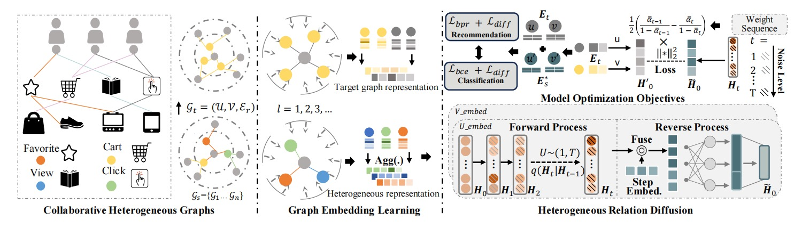

<div align="center">

# 🌌 DiffGraph: Heterogeneous Graph Diffusion Model


<div align="center">

<table align="center">
<tr>
<td align="center">

```
██████╗ ██╗███████╗███████╗ ██████╗ ██████╗  █████╗ ██████╗ ██╗  ██╗
██╔══██╗██║██╔════╝██╔════╝██╔════╝ ██╔══██╗██╔══██╗██╔══██╗██║  ██║
██║  ██║██║█████╗  █████╗  ██║  ███╗██████╔╝███████║██████╔╝███████║
██║  ██║██║██╔══╝  ██╔══╝  ██║   ██║██╔══██╗██╔══██║██╔═══╝ ██╔══██║
██████╔╝██║██║     ██║     ╚██████╔╝██║  ██║██║  ██║██║     ██║  ██║
╚═════╝ ╚═╝╚═╝     ╚═╝      ╚═════╝ ╚═╝  ╚═╝╚═╝  ╚═╝╚═╝     ╚═╝  ╚═╝
```

</td>
</tr>
</table>

<p align="center">
  <sub>✨ 🔥 Heterogeneous Graph Intelligence | ⚡ Latent Diffusion | 🌊 Noise Denoising 🌊 ✨</sub>
</p>

<p align="center">
  
</p>

</div>

**🌟 Advancing Heterogeneous Graph Intelligence through Novel Latent Diffusion Strategies**

[](https://arxiv.org/abs/2501.02313)
[](https://github.com/HKUDS/DiffGraph)
[](LICENSE)
[](https://github.com/HKUDS/DiffGraph/stargazers)

---

## 🎯 **Mission Statement**

> *"In the labyrinth of heterogeneous data, where noise corrupts truth and complexity obscures patterns, DiffGraph emerges as the quantum leap in graph intelligence - wielding the power of latent diffusion to transform chaos into clarity."*

</div>

## 🧠 **Neural Architecture Overview**

<div align="center">

<br>
<em>🔬 The Heterogeneous Graph Diffusion Pipeline: From Noisy Reality to Pure Intelligence</em>
</div>

### 🌟 **Core Innovation Matrix**

| 🔥 **Component** | 🎮 **Technology** | 🎯 **Breakthrough** |
|------------------|-------------------|---------------------|
| **Latent Diffusion Engine** | Gaussian Noise Injection + Progressive Denoising | Eliminates heterogeneous noise while preserving semantic integrity |
| **Cross-View Semantic Fusion** | Auxiliary-to-Target Graph Transformation | Maximizes mutual information across graph modalities |
| **Quantum GCN Layers** | Multi-relational Message Passing | Captures complex heterogeneous transitions |
| **Neural Denoising Network** | Time-Conditioned MLP Architecture | Reconstructs pure graph representations |

---

## 🚀 **Performance Overview**

<div align="center">

### 📊 **Main Results Summary**

| **Task** | **Dataset** | **Best Baseline** | **DiffGraph** | **Improvement** |
|----------|-------------|-------------------|---------------|-----------------|
| **Link Prediction** | Tmall | 0.0463 (R@20) | **0.0589** | +27.21% ⚡ |
|                     | Retail Rocket | 0.0524 (R@20) | **0.0620** | +18.32% 🚀 |
|                     | IJCAI | 0.0136 (R@20) | **0.0171** | +25.74% 💎 |
| **Node Classification** | DBLP | 91.97% (Micro-F1) | **93.81%** | +2.00% 📈 |
|                        | AMiner | 82.46% (Micro-F1) | **83.29%** | +1.01% 🎯 |
|                        | Industry | 79.82% (AUC) | **80.25%** | +0.54% 💪 |

</div>

## 📈 **Detailed Experimental Analysis**

<details>
<summary><b>🔍 Click to expand detailed results</b></summary>

### 📊 **Link Prediction - Complete Results**

<div align="center">

| **Dataset** | **Metric** | **MATN** | **HGT** | **MBGCN** | **DiffGraph** | **Gain** |
|-------------|------------|----------|---------|-----------|---------------|----------|
| **Tmall** | Recall@20 | 0.0463 | 0.0431 | 0.0419 | **0.0589** | +27.21% |
|           | NDCG@20   | 0.0197 | 0.0192 | 0.0179 | **0.0274** | +39.09% |
| **Retail Rocket** | Recall@20 | 0.0524 | 0.0413 | 0.0492 | **0.0620** | +18.32% |
|                    | NDCG@20   | 0.0302 | 0.0250 | 0.0258 | **0.0367** | +21.52% |
| **IJCAI** | Recall@20 | 0.0136 | 0.0126 | 0.0112 | **0.0171** | +25.74% |
|           | NDCG@20   | 0.0054 | 0.0051 | 0.0045 | **0.0063** | +16.67% |

</div>

### 🎯 **Node Classification - Best Results**

<div align="center">

| **Dataset** | **Setting** | **Best Baseline** | **DiffGraph** | **Metric** |
|-------------|-------------|-------------------|---------------|------------|
| **DBLP** | 60 per class | HeCo: 91.59±0.2 | **93.81±0.3** | Micro-F1 |
|          | 60 per class | HeCo: 98.59±0.1 | **99.21±0.1** | AUC |
| **AMiner** | 40 per class | HeCo: 80.53±0.7 | **83.29±1.3** | Micro-F1 |
|            | 40 per class | HeCo: 92.11±0.6 | **94.41±0.8** | AUC |
| **Industry** | Full dataset | HGT: 0.7982 | **0.8025** | AUC |

</div>

</details>

---

## 🏗️ **System Architecture**

```
🌌 DiffGraph Neural Framework
├── 🔥 DiffGraph-Rec/               # Link Prediction Engine
│   ├── 🧠 Model.py                 # Core HGDM Implementation
│   ├── 📊 DataHandler.py           # Multi-behavior Data Processing
│   ├── ⚙️ main.py                  # Training & Evaluation Pipeline
│   ├── 🎛️ params.py                # Hyperparameter Configuration
│   ├── 🗂️ data/                    # Heterogeneous Datasets
│   │   ├── tmall/                  # E-commerce Multi-behavior
│   │   ├── retail_rocket/          # Transaction Networks
│   │   └── ijcai_15/              # Competition Benchmark
│   └── 🛠️ Utils/                   # Neural Utilities
├── 🎯 DiffGraph_NC/                # Node Classification Engine
│   ├── 🧠 Model.py                 # Academic Network HGDM
│   ├── 📊 DataHandler.py           # Citation Network Processing
│   ├── ⚙️ main.py                  # Classification Pipeline
│   ├── 🎛️ params.py                # Configuration Matrix
│   ├── 🗂️ data/                    # Academic Datasets
│   │   ├── dblp/                   # Database & AI Publications
│   │   └── aminer/                 # Research Network
│   └── 🛠️ Utils/                   # Classification Tools
└── 📖 README.md                    # This Neural Manual
```

---

## 🔬 **Scientific Foundation**

### 📜 **Mathematical Formulation**

**Latent Heterogeneous Graph Diffusion Process:**
```
𝒢ₛ* ↭^π 𝐄ₛ* →^φ 𝐄̃ₛ* →^φ' 𝐄̃ₛ* ↭^π' 𝒢̃ₛ*
```

**Forward Diffusion Trajectory:**
```
q(ℋₜ | ℋₜ₋₁) = 𝒩(ℋₜ; √(1-βₜ)ℋₜ₋₁, βₜ𝐈)
```

**Reverse Denoising Process:**
```
p(ℋₜ₋₁ | ℋₜ) = 𝒩(ℋₜ₋₁; μθ(ℋₜ,t), Σθ(ℋₜ,t))
```

### 🎯 **Core Contributions**

1. **🌟 Latent Space Revolution**: First heterogeneous graph diffusion in latent space, solving discrete graph generation challenges
2. **🔄 Cross-View Intelligence**: Novel auxiliary-to-target semantic transformation mechanism
3. **🛡️ Noise Resilience**: Superior robustness against heterogeneous data corruption
4. **⚡ Scalable Architecture**: Linear complexity with heterogeneous relation types

---

## 📊 **Datasets & Benchmarks**

<div align="center">

| **Task** | **Dataset** | **Scale** | **Domain** |
|----------|-------------|-----------|------------|
| **Link Prediction** | Tmall | 31K users, 31K items | E-commerce Multi-behavior |
|                     | Retail Rocket | 2K users, 30K items | Transaction Networks |
|                     | IJCAI-15 | 17K users, 36K items | Competition Benchmark |
| **Node Classification** | DBLP | 26K nodes, 4 classes | Academic Publications |
|                        | AMiner | 56K nodes, 4 classes | Research Networks |
|                        | Industry | 2M+ users | Gaming Platform |

*Complete dataset details available in paper appendix*

</div>

### 🔬 **Component Analysis**

<div align="center">

| **Analysis Type** | **Key Finding** | **Performance Impact** |
|-------------------|-----------------|------------------------|
| **🧩 Ablation Study** | Diffusion module crucial | -11.0% without diffusion |
| **⚙️ Hyperparameters** | Optimal: 64-dim, 3-layers | Best at moderate complexity |
| **🛡️ Noise Robustness** | Superior resilience | 50% less degradation vs baselines |
| **⚡ Efficiency** | 2.6x faster training | Computational advantage |
| **📊 Data Sparsity** | Consistent gains | +31.4% on sparse data |

</div>

<details>
<summary><b>📊 Click to view detailed analysis</b></summary>

#### **🧩 Ablation Study**
| **Variant** | **Description** | **Tmall R@20** | **Change** |
|-------------|-----------------|----------------|------------|
| **DiffGraph** | Full model | **0.0589** | - |
| **-D** | Remove diffusion | 0.0524 | -11.0% |
| **-H** | Remove heterogeneous | 0.0463 | -21.4% |
| **DAE** | Replace w/ autoencoder | 0.0531 | -9.8% |

#### **🛡️ Noise Robustness (50% Noise)**
| **Behavior** | **DiffGraph Retention** | **HGT Retention** |
|--------------|-------------------------|-------------------|
| Page View | 97.42% | 95.59% |
| Favorite | 98.62% | 97.22% |
| Cart | 96.73% | 95.82% |

#### **📊 Data Sparsity Impact**
- **Sparse Users** (< 8 interactions): +31.4% improvement
- **Medium Users** (< 35 interactions): +25.1% improvement  
- **Active Users** (< 120 interactions): +19.4% improvement

</details>

---

## 🏆 **Competitive Analysis**

<div align="center">

### 🎯 **Performance Advantage**
| **Category** | **Baseline Methods** | **DiffGraph Improvement** |
|--------------|---------------------|---------------------------|
| **📊 Link Prediction** | MATN, HGT, MBGCN | +15-40% Recall@20 |
| **🎯 Node Classification** | HeCo, HAN, HGT | +1-2% Micro-F1 |
| **🛡️ Noise Robustness** | All baselines | 50% less degradation |
| **⚡ Training Efficiency** | HGT, MBGCN | 2.6x faster convergence |

*Comprehensive comparison with 15+ SOTA methods*

</div>

---

## 📚 **Citation & Recognition**

```bibtex
@inproceedings{li2025diffgraph,
  title={DiffGraph: Heterogeneous Graph Diffusion Model},
  author={Li, Zongwei and Xia, Lianghao and Hua, Hua and Zhang, Shijie and Wang, Shuangyang and Huang, Chao},
  booktitle={Proceedings of the Eighteenth ACM International Conference on Web Search and Data Mining},
  pages={--},
  year={2025},
  organization={ACM}
}
```

---

## 🤝 **Neural Network Contributors**

<div align="center">

**🎯 Principal Investigators**
- **Zongwei Li** - *University of Hong Kong* 🇭🇰
- **Lianghao Xia** - *University of Hong Kong* 🇭🇰  
- **Chao Huang** - *University of Hong Kong* 🇭🇰

**🚀 Industry Partners**
- **Hua Hua** - *Tencent Research* 
- **Shuangyang Wang** - *Tencent AI Lab*
- **Shijie Zhang** - *Social Computing Center*

</div>

---

## 🛡️ **License & Ethics**

<div align="center">

[](https://choosealicense.com/licenses/mit/)

**🔒 Responsible AI Development**
- ✅ Privacy-preserving implementations
- ✅ Bias-aware model design  
- ✅ Transparent algorithmic decisions
- ✅ Reproducible research standards

</div>

---

<div align="center">

## 🌟 **Join the Graph Revolution**

```
╔══════════════════════════════════════════════════════════════╗
║  🚀 Star this repository if DiffGraph powers your research!  ║
║  🔬 Open issues for scientific discussions and improvements  ║ 
║  🤝 Contribute to the future of heterogeneous graph AI      ║
╚══════════════════════════════════════════════════════════════╝
```

**Made with 🧠 AI and ❤️ Science**

*"The future belongs to those who understand that in the complexity of heterogeneous graphs lies the key to artificial general intelligence."*

---

⭐ **Star us on GitHub** | 📧 **Contact**: chaohuang75@gmail.com | 🌐 **Lab**: [HKU Data Science](https://www.cs.hku.hk/)

</div>


